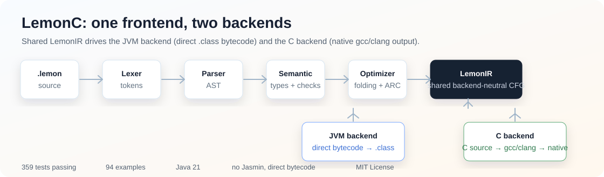
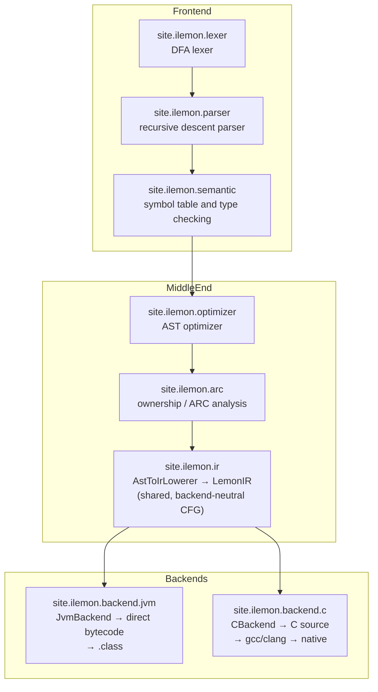
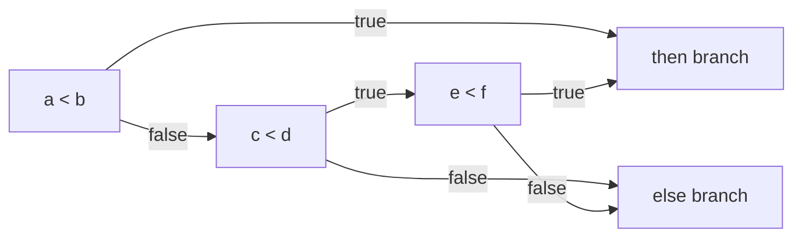
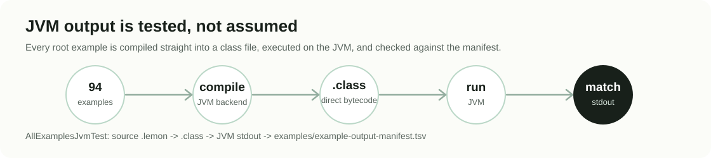

# LemonC

**LemonC is a production-focused C-like compiler written in Java.**

It is a **multi-backend compiler**: one shared frontend (lexer, parser, semantic analysis, ownership/ARC analysis) lowers to a backend-neutral **LemonIR**, which feeds two independent backends — a **JVM backend** that writes real JVM `.class` files directly (bytecode is emitted by hand, with no Jasmin assembler and no `.il` stage), and a **C backend** that emits C99 source for a native compiler. Both backends are validated end-to-end against real program output.

LemonC 是一个面向实际编译器工程实践的 C-like 编译器。它不仅能生成和检查中间表示，也能把 `.lemon` 源程序真正编译成 JVM 字节码或原生可执行文件，并用真实运行结果做端到端回归验证。

<p align="center">
  
</p>

```text
Java 21 | Maven | LemonIR → JVM or C backend | 359 tests passing | 94 examples | MIT License
```

## Why LemonC

| What you get | Why it matters |
|---|---|
| Complete compiler pipeline | Lexer, parser, semantic analyzer, optimizer, IR translator, bytecode generator |
| Real JVM execution | Examples compile to `.class` and run on a standard JVM |
| Compiler engineering fundamentals | Recursive descent parsing, Visitor-based semantic analysis, backpatching, stack-machine codegen |
| Developer-friendly inspection | CLI can dump tokens, AST, and JVM IR |
| Regression confidence | Example programs are checked against real JVM stdout |
| Compact and maintainable | A focused codebase for understanding and extending a full compiler |

## At A Glance

The project is intentionally small enough to reason about, but complete enough to demonstrate a real compiler pipeline from source code to JVM execution in a maintainable form.

## 30-Second Demo

Source: [examples/OptimizationTest.lemon](examples/OptimizationTest.lemon)

```c
void main() {
    int a;
    int b;
    bool c;
    a = (2 + 3) * 4;
    b = (a * 1) + 0;
    c = (1 < 2) && true;
    if (c) {
        printf("a=%d,b=%d\n", a, b);
    } else {
        printf("bad\n");
    }
    while (false) {
        printf("dead\n");
    }
}
```

Compile, inspect, and run (the JVM backend writes `.class` straight to `target/lemonc`):

```bash
mvn clean package

java -jar target/LemonC-0.1-beta-jar-with-dependencies.jar \
  examples/OptimizationTest.lemon --dump-tokens --dump-ast --dump-ir

java -cp target/lemonc OptimizationTest
```

The same source can target the C backend instead (`--target c`), producing native code through gcc/clang.

Real JVM output:

```text
a=20,b=20
```

The same example also demonstrates constant folding, algebraic simplification, boolean folding, dead `while(false)` removal, and the CLI inspection pipeline.

## What Lemon Supports

| Category | Features |
|---|---|
| Types | `byte`, `short`, `char`, `int`, `long`, `float`, `double`, `bool`, `string`, `void` |
| Arrays | `int[]`, `byte[]`, `short[]`, `char[]`, `long[]`, `float[]`, `double[]`, `bool[]`, `string[]`, indexed access, indexed assignment, `.length` |
| Arithmetic | `+`, `-`, `*`, `/`, `%`, unary `-` |
| Numeric widening | `byte/short/char -> int -> long -> float -> double` |
| Comparison | `>`, `<`, `>=`, `<=`, `==`, `!=` |
| Boolean logic | `true`, `false`, `!`, `&&`, `||`, short-circuit control flow |
| Control flow | `if/else`, `while`, `for`, `break`, `continue`, nested loops |
| Methods | parameters, return values, `void` methods, recursive calls, expression calls, `pub` exports |
| Modules | compile-time `import alias = @import("file.lemon")`, canonical path loading, public function exports, cycle diagnostics |
| Output | `printf`, `printLine`, `%d` (including `byte`, `short`, `char`, `int`, `long`), `%f`, `\n`, `\t` |
| Optimization | constant folding, boolean folding, algebraic simplification, constant branch simplification |
| Diagnostics | parse and semantic exceptions with source line context |

For the complete feature list with source code and real outputs, read [docs/LEMONC_FEATURES.md](docs/LEMONC_FEATURES.md).

Programs may declare functions directly at top level; the legacy `class` wrapper remains supported:

```c
int add(int left, int right) {
    return left + right;
}

void main() {
    printf("%d\n", add(20, 22));
}
```

See [examples/TopLevelFunctionsTest.lemon](examples/TopLevelFunctionsTest.lemon) and [examples/TopLevelArraysTest.lemon](examples/TopLevelArraysTest.lemon).

### Modules and visibility

Top-level functions are private by default. Prefix an exported function with `pub`, then import its module from a neighboring Lemon file:

```c
// math.lemon
pub int add(int left, int right) {
    return left + right;
}
```

```c
// main.lemon
import math = @import("math.lemon");

void main() {
    printf("%d\n", math.add(10, 20));
}
```

The complete example is available under [examples/modules](examples/modules). Imports are compile-time bindings, resolved relative to the importing file and rejected when the module is missing, cyclic, duplicated, or accessed through a non-public function.

## Compiler Architecture



LemonIR is the single abstraction shared by both backends. It is not shaped after either target: it holds backend-neutral control flow and typed operations, and each backend is responsible for lowering it to its own target (JVM bytecode or C source). No JVM-specific concept leaks into LemonIR, and no C-specific concept leaks into the JVM backend. The frontend, semantic analysis, ownership/ARC analysis, module resolution, and LemonIR itself are shared; only the final lowering differs.

| Module | Core classes | Responsibility |
|---|---|---|
| `site.ilemon.lexer` | `Lexer`, `Token`, `TokenKind` | Tokenize Lemon source code |
| `site.ilemon.parser` | `Parser` | Build frontend AST with recursive descent parsing |
| `site.ilemon.ast` | `Ast` | Define source-level expressions, statements, types, methods, and programs |
| `site.ilemon.semantic` | `SemanticVisitor`, `MethodVarTable`, `Symbol` | Type checking, declaration checks, assignment checks, return checks |
| `site.ilemon.optimizer` | `AstOptimizer` | Perform safe AST-level simplifications |
| `site.ilemon.arc` | `OwnershipAnalyzer`, `RefcountSimulator`, `OwnershipIr` | Shared ownership/ARC analysis for managed values (used before lowering) |
| `site.ilemon.ir` | `AstToIrLowerer`, `IrModule`, `IrVerifier`, `IrPrinter` | Lower the optimized AST to the backend-neutral LemonIR CFG |
| `site.ilemon.backend` | `Backend`, `BackendOptions`, `BackendResult` | Backend-neutral contract implemented by every backend |
| `site.ilemon.backend.jvm` | `JvmBackend`, `JvmClassWriter`, `JvmMethodEmitter`, `JvmInstructionEmitter`, `JvmStackTracker`, `JvmTypeMapper` | Lower LemonIR directly to JVM bytecode and write `.class` files (no Jasmin) |
| `site.ilemon.backend.c` | `CBackend`, `CFunctionEmitter`, `CInstructionEmitter`, `CTypeEmitter` | Lower LemonIR to C source and invoke the native compiler |
| `site.ilemon.compiler` | `LemonC`, `AstPrinter`, `IrPrinter` | CLI entrypoint and developer-facing diagnostics/dumps |

Backend selection is explicit at the CLI:

```bash
lemonc --target jvm program.lemon   # default: writes program.class
lemonc --target c   program.lemon   # writes program.c, then runs gcc/clang
```

## Short-Circuit Control Flow In Action

LemonC preserves classic C short-circuit semantics for `&&` and `||`: the right operand is only evaluated when it can change the result. When the shared `AstToIrLowerer` lowers a boolean expression it emits the branchy LemonIR shape below instead of eagerly materializing `0` or `1`.

For:

```c
if (a < b || c < d && e < f) {
    printf("yes\n");
} else {
    printf("no\n");
}
```

The LemonIR control-flow shape is:



Both backends consume this CFG unchanged:

```text
E1 || E2:   the false edge of E1 leads to E2; E2's exits decide the whole expression
E1 && E2:   the true  edge of E1 leads to E2; E2's exits decide the whole expression
```

The JVM backend turns each CFG edge into JVM labels and conditional jumps; the C backend emits `&&`/`||` operators or explicit branches. Because the CFG is the source of truth, neither backend re-analyzes the AST to rebuild control flow.

## JVM Output Is Tested, Not Assumed

Every root example under [examples](examples) is compiled and executed by [AllExamplesJvmTest.java](src/test/java/AllExamplesJvmTest.java):

<p align="center">
  
</p>

Run the suite:

```bash
mvn test
```

Current coverage:

```text
Tests run: 359, Failures: 0, Errors: 0, Skipped: 0
94 root examples verified by real JVM execution
```

## More Real Examples

### Numeric Widening, for, break, continue, arrays

Source: [examples/LanguageFeatureTest.lemon](examples/LanguageFeatureTest.lemon)

```text
sum=8
neg=-8
f=3.5,d=4.5
call=3.0,7.0
arr=2
```

### Nested loops

Source: [examples/NestedLoops.lemon](examples/NestedLoops.lemon)

```text
  inner run i=1, j=1
  inner break on 2
outer continue skip 2
  inner run i=3, j=1
  inner break on 2
```

### Floating-point NaN comparison

Source: [examples/NaNCompareTest.lemon](examples/NaNCompareTest.lemon)

```text
flt_lt=0
flt_lte=0
flt_gt=0
flt_gte=0
flt_eq=0
flt_neq=1
dbl_lt=0
dbl_lte=0
dbl_gt=0
dbl_gte=0
dbl_eq=0
dbl_neq=1
```

### Recursive Fibonacci

Source: [examples/Fib.lemon](examples/Fib.lemon)

```text
递归计算斐波那契数列，一年后总共有144对兔子
循环计算斐波那契数列，一年后总共有144对兔子
```

## Quick Start

Requirements:

```text
JDK 1.8+
Maven 3.3+
```

The compiler is self-contained — the JVM backend writes `.class` files directly, so there is no third-party bytecode/assembler dependency. (The C backend additionally expects `gcc` or `clang` on `PATH` when `--target c` is used.)

```bash
mvn clean package
```

Compile and run a Lemon program:

```bash
java -jar target/LemonC-0.1-beta-jar-with-dependencies.jar examples/Fib.lemon
java -cp target/lemonc Fib
```

Inspect compiler stages:

```bash
java -jar target/LemonC-0.1-beta-jar-with-dependencies.jar \
  examples/ModTest.lemon --dump-tokens --dump-ast --dump-ir
```

## Lemon Language In One Page

```c
int fib(int n) {
    int result;
    if (n < 3) {
        result = 1;
    } else {
        result = fib(n - 1) + fib(n - 2);
    }
    return result;
}

void main() {
    int i;
    int sum;
    int arr[3];
    sum = 0;

    for (i = 0; i < 3; i = i + 1) {
        arr[i] = i + 1;
        sum = sum + arr[i];
    }

    if (sum == 6 && fib(6) == 8) {
        printf("ok=%d\n", sum);
    } else {
        printf("bad\n");
    }
}
```

## Grammar Snapshot

```bnf
<program>       ::= <method>*
                  | "class" <id> "{" <method>* "}"
<method>        ::= <type> <id> "(" <params>? ")" "{" <varDecl>* <stmt>* "}"
                  | "void" "main" "(" ")" "{" <varDecl>* <stmt>* "}"
<params>        ::= <type> <id> ("," <type> <id>)*
<varDecl>       ::= <type> <id> ";"
                  | <type> <id> "[" <integer> "]" ";"
<type>          ::= "byte" | "short" | "char" | "int" | "long" | "float" | "double" | "bool" | "string" | "void"
<stmt>          ::= <id> "=" <expr> ";"
                  | <id> "[" <expr> "]" "=" <expr> ";"
                  | <id> "(" <args>? ")" ";"
                  | "if" "(" <expr> ")" <stmt> ("else" <stmt>)?
                  | "while" "(" <expr> ")" <stmt>
                  | "for" "(" <forInit> ";" <expr> ";" <forUpdate> ")" <stmt>
                  | "break" ";"
                  | "continue" ";"
                  | "{" <stmt>* "}"
                  | "return" <expr> ";"
                  | "printf" "(" <string> ("," <expr>)* ")" ";"
<expr>          ::= <andExpr> ("||" <andExpr>)*
<andExpr>       ::= <relExpr> ("&&" <relExpr>)*
<relExpr>       ::= <addExpr> ((">" | "<" | ">=" | "<=" | "==" | "!=") <addExpr>)*
<addExpr>       ::= <term> (("+" | "-") <term>)*
<term>          ::= <factor> (("*" | "/" | "%") <factor>)*
<forInit>       ::= <id> "=" <expr>
<forUpdate>     ::= <id> "=" <expr>
```

## Test Suite

| Test class | Count | Purpose |
|---|---:|---|
| Test class | Purpose |
|---|---|
| `AllExamplesJvmTest` | Compile every root example to `.class` via the JVM backend, run it, compare stdout against the manifest |
| `JvmBackendTest` | Structural tests of direct bytecode emission: descriptors, raw opcodes, max_stack/max_locals, verifier-valid control flow |
| `CompilerTest` | End-to-end compiler tests |
| `NativeEndToEndTest`, `CBackendTest` | C backend: LemonIR → C source → gcc/clang → native execution |
| `ArcCliTest`, `ArcOwnershipTest`, `ImportScopeArcTest`, `ArcControlFlowTest` | Shared ownership/ARC analysis and import scoping |
| `LemonIrTest`, `ModuleSystemTest`, `LemonCCliTest` | LemonIR lowering/verification, module imports, CLI flags |
| `LexerTest`, `ParserTest`, `ErrorTest`, `SemanticTest`, `AstOptimizerTest` | Frontend stages |
| `ByteCompilerTest`, `LongCompilerTest`, `ShortArrayCompilerTest`, … | Per-type JVM codegen and diagnostics |

## Repository Map

```text
src/main/java/site/ilemon
  ast/              source-level AST
  lexer/            tokenization
  parser/           recursive descent parser
  semantic/         symbol tables and type checking
  optimizer/        AST optimization
  arc/              ownership / ARC analysis (shared)
  ir/               LemonIR: backend-neutral CFG lowering + verification
  backend/          backend-neutral Backend contract (Backend, BackendOptions, BackendResult)
  backend/jvm/      JVM backend: LemonIR → direct JVM bytecode → .class
  backend/c/        C backend: LemonIR → C99 source → gcc/clang
  compiler/         CLI, AST printer, IR printer

examples/           94 Lemon programs and output manifest
runtime/            C runtime sources used by the C backend
docs/               feature guide and architecture notes
tools/              native backend experiment, kept outside main source
src/test/java/      automated compiler tests
```

## Current Language Boundaries

LemonC intentionally keeps the language small:

| Boundary | Status |
|---|---|
| Identifier `_` | Not part of the current lexer definition |
| Multi-line comments | Not part of the current language definition |
| Block scope | Blocks do not introduce independent local scopes |
| String variables | Strings are primarily `printf` literals |
| Object model | Top-level function language focused on compiler/runtime correctness, not full Java |

## Roadmap

The codebase now has enough substance for a serious production-oriented compiler project. The next milestones are:

1. Keep GitHub Actions green and show a real CI badge.
2. Publish `v0.2.0` release with a ready-to-run jar.
3. Add an English tutorial: "Build a JVM compiler from scratch with LemonC".
4. Add visual snapshots of token, AST, and IR dumps.
5. Add CFG/data-flow optimization as the next advanced chapter.
6. Add GitHub topics: `compiler`, `compiler-design`, `jvm`, `bytecode`, `parser`, `semantic-analysis`, `backpatching`, `language-runtime`.

## License

LemonC is released under the [MIT License](LICENSE).
